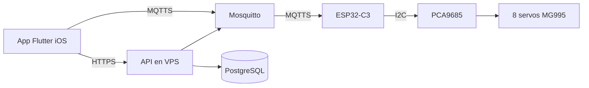
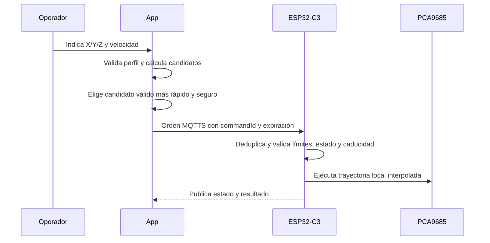
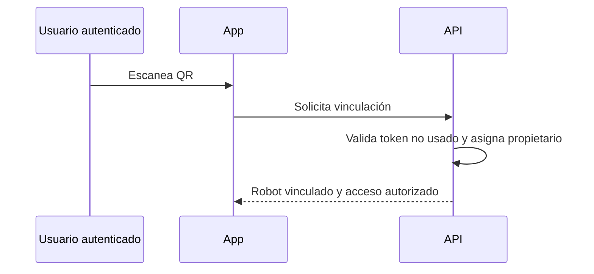

# Plan técnico — Control maestro AiRobot

## Alcance y trazabilidad

| ID | Requisito funcional |
| --- | --- |
| RF-01 | Control manual individual de servos |
| RF-02 | Movimiento cartesiano del TCP en X/Y/Z |
| RF-03 | Rechazo de destinos fuera de alcance o límites |
| RF-04 | Selección de solución articular válida, rápida y segura |
| RF-05 | Enseñanza desde controles de la app |
| RF-06 | Crear, editar, guardar y ejecutar programas |
| RF-07 | Pasos con punto, velocidad, pausa y acción de garra |
| RF-08 | Configuración mecánica y calibración |
| RF-09 | Home, estado y parada de emergencia |
| RF-10 | Cuenta y vinculación exclusiva por QR |
| RF-11 | Persistencia cloud de perfiles, secuencias y propiedad |

## 1. Arquitectura general

**RF cubiertos:** RF-01, RF-02, RF-03, RF-04, RF-05, RF-06, RF-07, RF-08, RF-09, RF-10, RF-11.

La solución se divide en cuatro límites de responsabilidad:

- La app Flutter presenta controles y flujos; sus ViewModels invocan casos de uso del dominio.
- El backend API autentica usuarios, gestiona propiedad, emparejamiento QR y persistencia.
- Mosquitto enruta mensajes MQTTS únicamente entre identidades autorizadas y los tópicos de cada robot.
- El firmware del ESP32-C3 es la autoridad final: valida órdenes, guarda configuración activa, calcula o recibe metas válidas, interpola movimiento y controla el PCA9685.

El origen X=0, Y=0, Z=0 se fija al confirmar la posición home durante la configuración. El TCP es el centro de contacto de las mordazas. La app valida de forma preventiva; el firmware repite las validaciones antes de accionar hardware.

## 2. Estructura de módulos

**RF cubiertos:** RF-01, RF-02, RF-03, RF-04, RF-05, RF-06, RF-07, RF-08, RF-09, RF-10, RF-11.

### Aplicación Flutter

- `presentation`: pantallas de autenticación, emparejamiento, control manual, movimiento cartesiano, programas, configuración y estado.
- `viewmodels`: estado de pantalla, validación de entrada y coordinación de casos de uso.
- `domain`: entidades, reglas de cinemática, selección de solución, límites, programas y casos de uso.
- `data`: repositorios de API, MQTT, almacenamiento local y transformación de DTOs.
- `infrastructure`: clientes HTTPS/MQTT, almacenamiento seguro de sesión y observabilidad.

### Backend

- Identidad y autorización de cuenta.
- Inventario de robots y vínculo exclusivo propietario-robot.
- Consumo atómico de token QR de un solo uso.
- Perfiles versionados de configuración y programas nombrados.
- Emisión y revocación de permisos MQTT por robot.

### Firmware

- Gestor de red, identidad del dispositivo y conexión MQTTS.
- Validador de orden, caducidad y deduplicación.
- Gestor de configuración, home, calibración y límites por servo.
- Cinemática, planificador de trayectoria y ejecutor de secuencias.
- Adaptador PCA9685 y supervisor de estado/emergencia.

## 3. Modelo de datos

**RF cubiertos:** RF-01, RF-02, RF-03, RF-04, RF-05, RF-06, RF-07, RF-08, RF-09, RF-10, RF-11.

| Entidad | Datos principales |
| --- | --- |
| Usuario | id, identidad autenticada, estado |
| Robot | id, serial, propietario, estado de vinculación, última conexión |
| Token de emparejamiento | robotId, token de un uso, expiración, estado de consumo |
| Perfil mecánico | robotId, versión, longitudes, home, TCP, fecha de vigencia |
| Configuración de servo | perfilId, eje lógico, canal PCA, cero, rango, inversión, offset, velocidad, aceleración |
| Relación de J2 | perfilId, servo primario, servo secundario, relación, compensaciones |
| Programa | id, robotId, nombre, versión, propietario, estado |
| Paso de programa | programaId, orden, X/Y/Z, acción de garra, velocidad, pausa |
| Orden | commandId, robotId, tipo, creadaEn, expiraEn, carga, resultado |
| Estado de robot | robotId, conexión, modo, programa activo, posición objetivo, error |

Las longitudes iniciales del perfil son J1→J2=80 mm, J2→J3=120 mm, J3→J4=70 mm, J4→J5=80 mm, J5→J6=80 mm y J6→TCP=140 mm. El mapeo físico PCA9685-servo no se fija en el código.

## 4. Diagramas de flujo operativo

**RF cubiertos:** RF-01, RF-02, RF-03, RF-04, RF-05, RF-06, RF-07, RF-08, RF-09, RF-10, RF-11.

### Movimiento cartesiano y ejecución local

### Emparejamiento

Ante pérdida de red, el ESP32 conserva localmente la última posición objetivo mientras la parada de emergencia mantiene prioridad sobre cualquier modo.

## 5. Decisiones técnicas justificadas

**RF cubiertos:** RF-01, RF-02, RF-03, RF-04, RF-05, RF-06, RF-07, RF-08, RF-09, RF-10, RF-11.

| Decisión | Justificación |
| --- | --- |
| Flutter con MVVM y Clean Architecture | Mantiene la UI independiente de cinemática, MQTT y persistencia. |
| ESP32-C3 + PCA9685 | Separa comunicación Wi-Fi de generación PWM para ocho servos. |
| MQTTS por robot | Permite teleoperación remota con autorización y estado asíncrono. |
| Backend + PostgreSQL | Conserva propiedad, perfiles y programas entre teléfonos. |
| Firmware estable y configuración versionada | Las calibraciones no requieren reflashear el robot. |
| Validación doble app/firmware | La app mejora la experiencia; el firmware protege el hardware. |
| QR de un solo uso | Vincula un robot a una cuenta sin exponer credenciales permanentes. |
| Home configurable | Adapta la referencia cartesiana al ensamblaje físico real. |
| Solución articular más rápida y segura | Prioriza tiempo solo entre configuraciones dentro de límites y condiciones de seguridad. |

## 6. Alternativas descartadas

**RF cubiertos:** RF-01, RF-02, RF-03, RF-04, RF-05, RF-06, RF-07, RF-08, RF-09, RF-10, RF-11.

| Alternativa | Motivo de descarte |
| --- | --- |
| Arduino Nano 33 IoT | El proyecto confirmó el cambio a ESP32-C3 Mini. |
| Generar y cargar firmware por cada ajuste | La configuración mecánica debe cambiar sin modificar firmware. |
| Control físico manual para enseñar posiciones | Los MG995 no entregan posición real al sistema. |
| MQTT sin TLS o credenciales compartidas | No satisface el control remoto seguro ni el aislamiento por robot. |
| Lógica de seguridad únicamente en Flutter | La conexión remota puede fallar y la app no controla directamente el hardware. |
| Guardar secuencias solo en el teléfono | No permite recuperación al cambiar de dispositivo ni soporta el modelo comercial. |

## 7. Estrategia de pruebas

**RF cubiertos:** RF-01, RF-02, RF-03, RF-04, RF-05, RF-06, RF-07, RF-08, RF-09, RF-10, RF-11.

| Nivel | Cobertura |
| --- | --- |
| Unidad | Cinématica inversa, alcance, límites, inversiones, offsets, selección de solución, caducidad y deduplicación. |
| Integración | Flutter-API, vinculación QR, autorización, persistencia, MQTT, firmware-PCA9685. |
| Sistema | Control manual, home, configuración, ejecución de programa, secuencias en nube y reconexión. |
| Seguridad | Parada de emergencia, destinos inválidos, mensaje vencido/duplicado, comando sin propiedad, pérdida de red y límites de J2. |
| Hardware | Servos individuales a baja velocidad, coordinación de los dos servos de J2, fuente externa, I2C y prueba progresiva de alcance. |

No se realizan movimientos físicos a velocidad normal hasta que las validaciones de configuración, límites y parada de emergencia hayan sido aprobadas.
