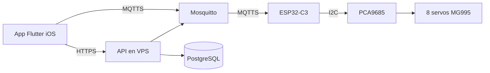
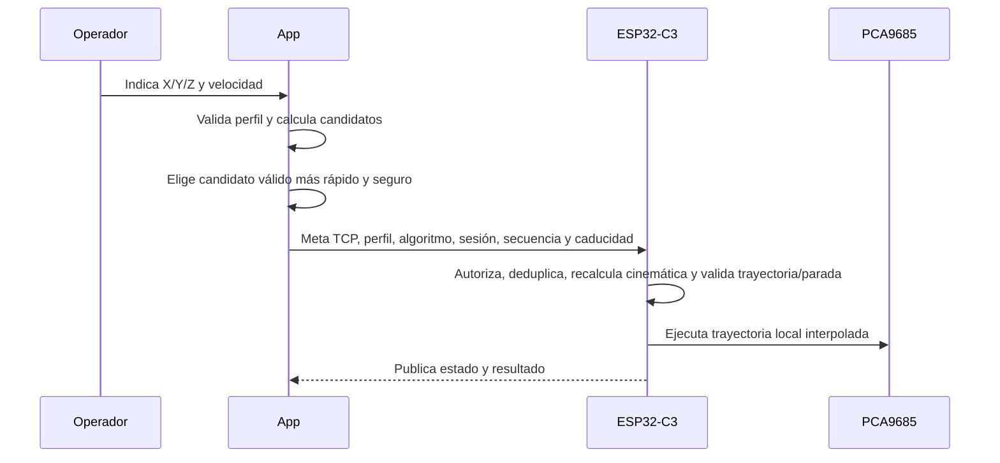
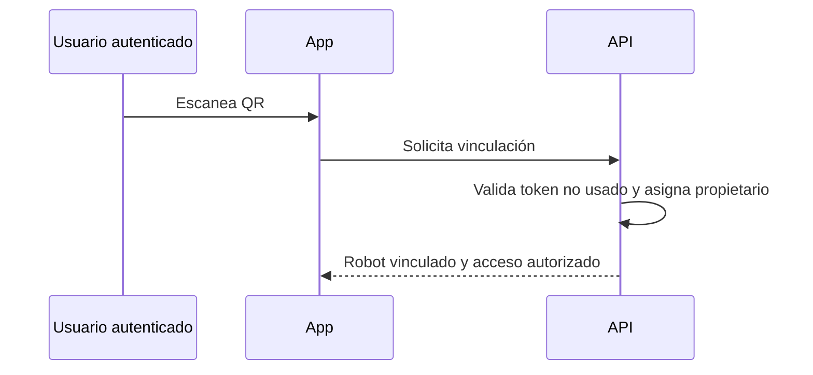

# Plan técnico — Control maestro AiRobot

## Alcance y trazabilidad

| ID | Requisito funcional |
| --- | --- |
| RF-01 | Control lógico J1–J7 y calibración física restringida |
| RF-02 | Movimiento cartesiano del TCP en X/Y/Z |
| RF-03 | Rechazo de destinos fuera de alcance o límites |
| RF-04 | Selección de solución articular válida, rápida y segura |
| RF-05 | Enseñanza desde controles de la app |
| RF-06 | Crear, editar, guardar y ejecutar programas |
| RF-07 | Pasos con punto, velocidad, pausa y acción de garra |
| RF-08 | Configuración mecánica y calibración |
| RF-09 | Home, estado y parada de emergencia |
| RF-10 | Cuenta y vinculación exclusiva por QR |
| RF-11 | Persistencia cloud de perfiles, secuencias y propiedad |

## 1. Arquitectura general

La solución se divide en cuatro límites de responsabilidad:

- La app Flutter presenta controles y flujos; sus ViewModels invocan casos de uso del dominio.
- El backend API autentica usuarios, gestiona propiedad, emparejamiento QR y persistencia.
- Mosquitto enruta mensajes MQTTS únicamente entre identidades autorizadas y los tópicos de cada robot.
- El firmware del ESP32-C3 es la autoridad final: valida órdenes, guarda configuración activa, recalcula y valida metas y trayectorias con perfil y algoritmo versionados, interpola movimiento y controla el PCA9685.

El origen X=0, Y=0, Z=0 se fija al confirmar la posición home durante la configuración. El TCP es el centro de contacto de las mordazas. La app valida de forma preventiva; el firmware repite las validaciones antes de accionar hardware.

## 2. Estructura de módulos

### Aplicación Flutter

- `presentation`: pantallas de autenticación, emparejamiento, control manual, movimiento cartesiano, programas, configuración y estado.
- `viewmodels`: estado de pantalla, validación de entrada y coordinación de casos de uso.
- `domain`: entidades, reglas de cinemática, selección de solución, límites, programas y casos de uso.
- `data`: repositorios de API, MQTT, almacenamiento local y transformación de DTOs.
- `infrastructure`: clientes HTTPS/MQTT, almacenamiento seguro de sesión y observabilidad.

### Backend

- Identidad y autorización de cuenta.
- Inventario de robots y vínculo exclusivo propietario-robot.
- Consumo atómico de token QR de un solo uso.
- Perfiles versionados de configuración y programas nombrados.
- Emisión y revocación de permisos MQTT por robot.

### Firmware

- Gestor de red, identidad del dispositivo y conexión MQTTS.
- Validador de orden, caducidad y deduplicación.
- Gestor de configuración, home, calibración y límites por servo.
- Cinemática, planificador de trayectoria y ejecutor de secuencias.
- Adaptador PCA9685 y supervisor de estado/emergencia.

## 3. Modelo de datos

| Entidad | Datos principales |
| --- | --- |
| Usuario | id, identidad autenticada, estado |
| Robot | id, serial, propietario, estado de vinculación, última conexión |
| Token de emparejamiento | robotId, token de un uso, expiración, estado de consumo |
| Perfil mecánico | robotId, versión, longitudes, home, TCP, fecha de vigencia |
| Configuración de servo | perfilId, eje lógico, canal PCA, cero, rango, inversión, offset, velocidad, aceleración |
| Relación de J2 | perfilId, servo primario, servo secundario, relación, compensaciones |
| Programa | id, robotId, nombre, versión, propietario, estado, profileVersion, profileHash, kinematicsVersion, homeRevision, orientación fija |
| Paso de programa | programaId, orden, X/Y/Z, acción de garra, velocidad, pausa |
| Orden | schemaVersion, commandId, robotId, bootId, controlSessionId, sequence, createdAtEpochMs, expiresAtEpochMs, profileVersion, profileHash, kinematicsVersion, tipo, carga, resultado |
| Estado de robot | robotId, bootId, conexión, estado de movimiento, causa, programa activo, consignas, TCP estimado, validez de referencia, perfil activo, error |

Las longitudes iniciales del perfil son J1→J2=80 mm, J2→J3=120 mm, J3→J4=70 mm, J4→J5=80 mm, J5→J6=80 mm y J6→TCP=140 mm. El mapeo físico PCA9685-servo no se fija en el código.

## 4. Diagramas de flujo operativo

### Movimiento cartesiano y ejecución local

### Emparejamiento

Ante pérdida de control se cancela el programa, se ejecuta una parada controlada local y se mantiene su consigna final en HOLD. Reconectar no reanuda. La emergencia enclavada tiene prioridad desde cualquier estado; las transiciones y requisitos físicos se definen en spec.md.

## 5. Decisiones técnicas justificadas

| Decisión | Justificación |
| --- | --- |
| Flutter con MVVM y Clean Architecture | Mantiene la UI independiente de cinemática, MQTT y persistencia. |
| ESP32-C3 + PCA9685 | Separa comunicación Wi-Fi de generación PWM para ocho servos. |
| MQTTS por robot | Permite teleoperación remota con autorización y estado asíncrono. |
| Backend + PostgreSQL | Conserva propiedad, perfiles y programas entre teléfonos. |
| Firmware estable y configuración versionada | Las calibraciones no requieren reflashear el robot. |
| Validación doble app/firmware | La app mejora la experiencia; el firmware protege el hardware. |
| QR de un solo uso | Vincula un robot a una cuenta sin exponer credenciales permanentes. |
| Home configurable | Adapta la referencia cartesiana al ensamblaje físico real. |
| Solución articular más rápida y segura | Prioriza tiempo solo entre configuraciones dentro de límites y condiciones de seguridad. |

## 6. Alternativas descartadas

| Alternativa | Motivo de descarte |
| --- | --- |
| Arduino Nano 33 IoT | El proyecto confirmó el cambio a Seeed Studio XIAO ESP32-C3. |
| Generar y cargar firmware por cada ajuste | La configuración mecánica debe cambiar sin modificar firmware. |
| Control físico manual para enseñar posiciones | Los MG995 no entregan posición real al sistema. |
| MQTT sin TLS o credenciales compartidas | No satisface el control remoto seguro ni el aislamiento por robot. |
| Lógica de seguridad únicamente en Flutter | La conexión remota puede fallar y la app no controla directamente el hardware. |
| Guardar secuencias solo en el teléfono | No permite recuperación al cambiar de dispositivo ni soporta el modelo comercial. |

## 7. Estrategia de pruebas

| Nivel | Cobertura |
| --- | --- |
| Unidad | Cinemática inversa, alcance, límites, inversiones, offsets, selección de solución, caducidad y deduplicación. |
| Integración | Flutter-API, vinculación QR, autorización, persistencia, MQTT, firmware-PCA9685. |
| Sistema | Control manual, home, configuración, ejecución de programa, secuencias en nube y reconexión. |
| Seguridad | Parada de emergencia, destinos inválidos, mensaje vencido/duplicado, comando sin propiedad, pérdida de red y límites de J2. |
| Hardware | Servos individuales a baja velocidad, coordinación de los dos servos de J2, fuente externa, I2C y prueba progresiva de alcance. |

No se realizan movimientos físicos a velocidad normal hasta que las validaciones de configuración, límites y parada de emergencia hayan sido aprobadas.

## 8. Contratos de implementación

### Estado y control local

Implementar la máquina de estados de `spec.md` en dominio de firmware, separada de MQTT y del adaptador PWM. La app refleja el estado confirmado por el dispositivo; no puede asignarse `READY` ni limpiar un enclavamiento por su cuenta; solicita resetLatch y espera confirmación del firmware. El supervisor local debe poder procesar entrada de emergencia y pérdida de control sin esperar DNS, TLS, publicación MQTT ni escritura de almacenamiento. Las operaciones de red no bloquean el ciclo de control. Medir latencia máxima con carga de red; el umbral admisible pertenece al perfil físico validado.

El arranque produce un `bootId` nuevo y no emite consignas de movimiento hasta habilitación explícita autenticada y referencia confirmada. D-02 excluye pulsador físico y circuito de corte para esta etapa. Implementar el enclavamiento congelando la última consigna emitida y bloqueando actualizaciones posteriores, sin afirmar corte de energía ni parada física instantánea. Probar recuperación de reinicio y detección local de pérdida de control; un bloqueo del controlador o fallo del driver queda fuera de las garantías de esta parada por software.

### Responsabilidad de cinemática

La app usa un modelo puro del dominio para previsualizar y rechazar metas inválidas. El ESP32 recibe intención cartesiana, orientación fija y referencias de perfil/algoritmo; vuelve a resolver desde su consigna vigente, valida la trayectoria completa y ejecuta. Los ángulos de previsualización no autorizan movimiento. Para operación manual recibe una articulación lógica y su objetivo; J2 se transforma en un par validado atómicamente.

Implementar la misma especificación determinista de candidatos, tiempos y desempates en ambos entornos, con vectores de prueba compartidos. La equivalencia numérica se verifica con tolerancias versionadas; no se exige igualdad binaria entre Dart y C++. Antes de activar TCP medir memoria y tiempo de planificación en ESP32-C3. Si excede el presupuesto del supervisor, mantener TCP bloqueado y revisar explícitamente el diseño, sin trasladar silenciosamente la autoridad a la app.

### Transporte y autorización

Tópicos bajo `airobot/v1/robots/{robotId}/`: `command`, `emergency`, `state`, `availability`, `telemetry`, `config` y `ack`. Comandos, emergencia, configuración y ACK no son retenidos; estado y disponibilidad sí. Comandos, emergencia y ACK usan QoS 1; telemetría puede usar QoS 0. La implementación debe soportar estas capacidades, incluida detección del indicador retained; no se presupone que la librería actual las proporcione. Las órdenes retenidas se rechazan y nunca se usan como cola de reconexión.

Backend emite credenciales MQTT temporales con ACL por robot y una autorización de control firmada, verificable en el dispositivo, vinculada a robot, propietario, `bootId`, sesión y caducidad. No basta confiar en un `ownerId` enviado por la app. Solo existe una sesión de control activa por robot; la concesión es atómica. El firmware verifica autorización al abrir/renovar sesión y sus referencias en cada orden. Revocar permisos corta nuevas concesiones; una sesión desconectada expira localmente según el plazo validado del perfil. La implementación debe elegir y probar una biblioteca criptográfica mantenida, sin diseñar criptografía propia.

La emergencia remota usa ACL/autorización específica de parada para el robot; no requiere poseer la sesión exclusiva de movimiento y no espera sincronización NTP. Su único efecto permitido es enclavar, nunca habilitar. Repetirla es idempotente. El rearme usa resetLatch según spec.md, por una sesión de recuperación autenticada con nonce de un solo uso ligado al enclavamiento actual. Requiere reloj confiable y caducidad; si no están disponibles, permanece bloqueado. Una sesión de recuperación no autoriza movimiento. El rearme no habilita ni reanuda y se rechaza si persiste la causa del fallo.

### Sobre de órdenes normales y rechazo de repetición

Cada orden lleva los campos de la entidad Orden y una carga de esquema estricto. Rechazar tipos incorrectos, números no finitos, enteros fuera de rango antes de convertirlos, campos obligatorios ausentes, versiones desconocidas y cargas por encima del tamaño anunciado. Validar `createdAtEpochMs <= expiresAtEpochMs`, reloj confiable, desviación admitida y TTL máximo del contrato; los plazos nunca sustituyen el watchdog monotónico de sesión.

El dispositivo genera `bootId`; negocia un `controlSessionId` nuevo al habilitar control. Dentro de la sesión acepta `sequence` estrictamente creciente, sin wraparound. Un mismo `commandId` se reenvía con la misma secuencia y carga. Registrar de forma atómica la secuencia y la decisión antes de habilitar efectos; una orden autenticada rechazada también consume su secuencia. Conservar una caché acotada de IDs, hash de carga y resultados durante la sesión: una repetición idéntica devuelve el resultado conocido sin ejecutar, y un ID reutilizado con otra carga se rechaza. Una secuencia antigua fuera de caché se rechaza aunque no pueda devolverse el ACK original. Reinicio, reconexión o activación de perfil invalidan la sesión; sobres antiguos no se ejecutan.

ACK distingue `accepted`, `rejected`, `started`, `completed` y `cancelled`, con `commandId`, secuencia, causa y perfil activo. El estado conserva el identificador de la ejecución para reconciliar un ACK perdido. `accepted` no significa posición alcanzada. Home es una trayectoria ordinaria validada con todos sus ejes antes de ejecutarse; no es búsqueda de referencia ni excepción a emergencia, límites o sesión.

### Configuración y programas

Descargar y validar programas completos antes de iniciar; jamás ejecutar una transferencia parcial. Cada paso se recalcula desde la consigna inicial prevista con el mismo perfil activo. Una sesión vigente sigue siendo obligatoria durante toda la ejecución. Validar antes del inicio tamaño, tipos, puntos, pausas, garra, límites y trayectorias; repetir comprobaciones de estado y vigencia antes de cada paso.

El dispositivo anuncia capacidades versionadas: tamaño máximo de mensaje, programa y pasos, TTL y pausas máximas, tolerancias numéricas y versiones soportadas. Los tamaños se fijan tras medir memoria; los tiempos de seguridad se validan físicamente. Sin capacidades compatibles la app no publica movimiento. La activación atómica de un perfil exige integridad por hash y validación local, conserva el anterior ante fallo y marca referencias incompatibles para revalidación.

## 9. Fases, dependencias y aceptación

| Fase | Entrega concreta | Depende de | RF | Criterio de cierre |
| --- | --- | --- | --- | --- |
| F0 | Contrato versionado, esquemas, estados, simulador y vectores de prueba | Ninguna | RF-03, RF-08, RF-09 | AC-01/02/05/09 pasan en simulación; campos, errores y capacidades están documentados. |
| F1 | Supervisor firmware, enclavamiento, sesiones y adaptador de salidas simulado | F0 | RF-01, RF-03, RF-09 | AC-01/02/05/09 con reinicios, duplicados intercalados, fallos y latencia de red; sin actuadores. |
| F2 | Perfil atómico, calibración, relación J2, límites e interpolación | F1 | RF-01, RF-03, RF-08, RF-09 | AC-03 y pruebas de offsets/inversiones, home atómico y paradas; hardware solo tras validar límites físicos y comportamiento de parada por software; D-02 no exige componentes adicionales. |
| F3 | Backend, identidad, QR de un uso, ACL, sesiones y persistencia | F0 | RF-10, RF-11 | AC-08, consumo concurrente de QR, aislamiento entre robots y expiración/revocación. |
| F4 | Proyectos Flutter iOS, MVVM, repositorios, control manual y estado real | F1, F2, F3 | RF-01, RF-08, RF-09, RF-10 | AC-07; integración con dispositivo simulado y reconexión sin reanudar. |
| F5 | Modelo mecánico, cinemática en app/firmware y validación de trayectoria | F2; D-03 y calibración para hardware | RF-02, RF-03, RF-04 | AC-04 con casos válidos, fuera de alcance, singularidades según política del algoritmo, colisiones del modelo y presupuesto medido de ejecución. |
| F6 | Enseñanza, programas versionados y ejecución local | F3, F4, F5 | RF-05, RF-06, RF-07, RF-11 | AC-06 y AC-01/02 durante cualquier paso/pausa; transferencia incompleta no ejecuta. |
| F7 | Integración física progresiva y evidencia de aceptación | F1–F6; D-03 y calibración resueltas | RF-01–RF-11 | AC-01–AC-09 con parámetros reales documentados y sin posiciones físicas afirmadas por telemetría de consignas. |

La matriz indica cobertura prevista, no funciones ya implementadas. D-01 registra la aceptación de caída al perder energía. D-02 excluye botón y corte físico por decisión del propietario; D-03 requiere documentar geometría y calibración. Las pruebas de contratos, simulación, UI y backend pueden avanzar mientras el hardware permanece bloqueado.

## 10. Registro de decisiones

Se adoptan: parada de software enclavada con rearme autenticado validado por firmware; parada controlada y cancelación por pérdida de control; reconexión sin movimiento; operación normal por articulación; orientación home fija para TCP; trayectorias articulares punto a punto; resolución determinista repetida en firmware; programas ligados al perfil; sesión exclusiva, secuencias y caducidad.

D-01 y D-02 están resueltas: se acepta la caída al perder energía y se excluyen botón físico y circuito de corte en esta etapa. Permanecen pendientes D-03 y los parámetros obtenidos de calibración y pruebas. La ausencia de esos componentes no bloquea el alcance actual; siguen siendo necesarias las validaciones de límites, referencia y parada por software antes de activar actuadores. Estas decisiones actualizan el diseño y requieren implementación posterior en app y firmware.

## Ajuste de alcance — 13 de septiembre de 2026

Por decisión del usuario, se pospone la autorización por propietario y las ACL específicas por robot. Todos los usuarios autenticados pueden consultar los robots registrados y solicitar su sesión de control. La asociación mediante QR es opcional para el acceso. Esta decisión prevalece sobre los apartados anteriores que exigen aislamiento por propietario.

La conexión inicial confirma una respuesta del ESP32 y presenta un indicador de conexión en curso, éxito o error. No exige calibración ni programas guardados. Se mantienen TLS, autenticación general, vigencia de mensajes, validación de destino/arranque, sesión exclusiva y límites locales de movimiento. Conectar no habilita ni mueve servos. El simulador se identifica por separado.
